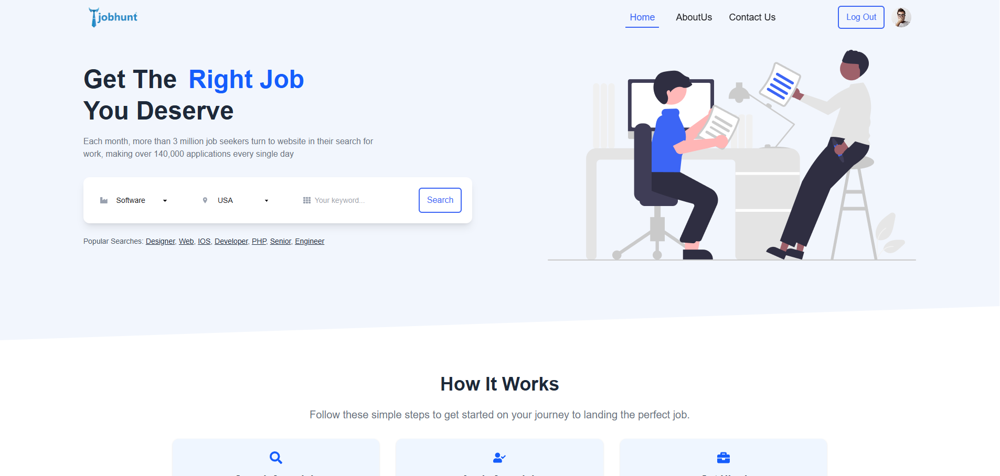

# 🧑‍💼 Job Hunt - Professional Job Portal

A comprehensive job listing platform that enables users to browse, search, and apply for jobs seamlessly, with secure authentication and a user-friendly interface.

🔎 Project Overview
Job Hunt is a web application designed to connect job seekers with employers by providing up-to-date job listings, detailed job descriptions, and an easy application process. Authenticated users can manage their profiles, track applications, and save favorite jobs.

🖼 Screenshot

---
## 🔗 Live Demo

[🌐 Live Website](https://job-hunt-8ca298.netlify.app/)

## 🚀 Core Features

- 🔐 User registration and login
- 👤 Update profile with image upload
- 📄 Dynamic job listing cards
- 🔍 Job search and filtering (planned)
- 🧭 Custom 404 Not Found page
- 🖼 About Us & animated sections
- 📧 Password reset with Gmail redirect

---

## 🔐 Protected Routes

Protected using a `PrivateRoute` component that checks user authentication via context and JWT.

Pages:
- `/add-service`
- `/my-services`
- `/my-reviews`
- `/service-details/:id`

---

## 🧑‍💻 Tech Stack

**Frontend:**
- React.js
- React Router v6.4+
- Tailwind CSS
- DaisyUI
- React Icons

---

🚀 Run Locally — Step by Step
1. Clone the repository  
git clone [Clone](https://github.com/hosenrabby/JobHunt-A9.git) 
cd reviewTracker 
Run dependencies 
- npm install
- npm run dev
---
📬 Contact

Reach me at: hosenrabby.dev@gmail.com

